**Preface**
****
Provided with datasets on home sales in Ames, Iowa from the years
2006-2010, the task given is to perform an exploratory data analysis
determining the suitability of using a linear regression for prediction
of Sale Price. A regression performed on the response variable Sale
Price as explained by 23 predictor variables. The multiple linear
regression model is then scrutinized to evaluate its suitability for use
as a tool in prediction, and to identify which variables are significant
predictors ranked by P-value and correlation.
Sample predictions were performed
on the first 20 occurrences of complete cases in the testing dataset.
Summary statistics of the linear model result in an adjusted R-squared
value of 0.84, and an R-value of 0.9 which is strong evidence that the
model is an accurate and strong predictor of Sale Price. Overall Quality
of the home had the greatest predictive power in explaining Sale Price.
Technologies utilized for visualization and analysis include: RStudio,
the base R-package, caret, dplyr,
corrplot, and PerformanceAnalytics.

**Data Summary**
*****
In preparation for data
analysis the ID attribute was removed, and a combined data frame was
created for the purposes of frequency comparison using histograms.

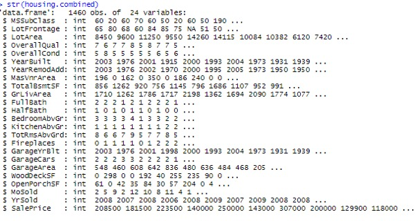

Figure 1 - R output for Structure of the combined dataset.

As shown in Figure 1,
the training and testing data sets consist of 1000 and 460 observations
of 24 variables. The datasets were imported into R using
read.csv(), and all variables were assigned a
numeric datatype by default. It was noted that the
MSSubClass attribute is in fact a
categorical factor with 16 levels. Substantial consideration was given
in determining if modifying the type was necessary, a judgement was made
that doing so would only complicate programming the model. Therefore,
the int datatype was preserved. Later in the analysis it become apparent
that this decision did not impact the accuracy of the linear model.

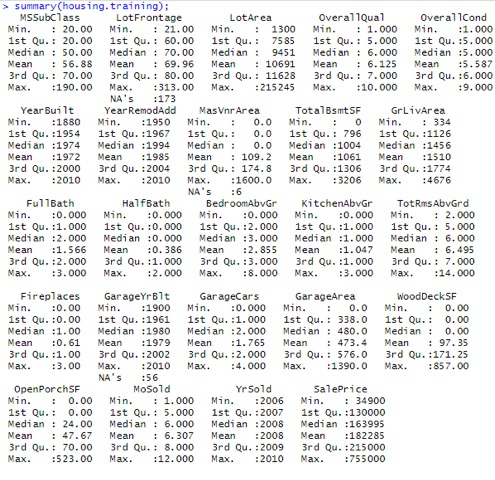 

Figure 2 - R Summary statistics output for the training dataset.

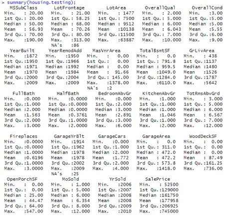

Figure 3 - R Summary statistics output for the testing set.

  
The summary statistics
displayed in Figure 2 and Figure 3 were used to confirm homogeneity
between the testing and training set prior to testing. It is important
to observe the cases where the statistics output is meaningless, in this
case, the obvious problem is with MSubClass. The narrow difference in the standard deviation of the response
variable for each dataset, expressed by Figure 4, also supports their
suitability for testing.

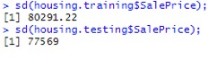

Figure 4 - R outputs for standard deviation for Sale Price.

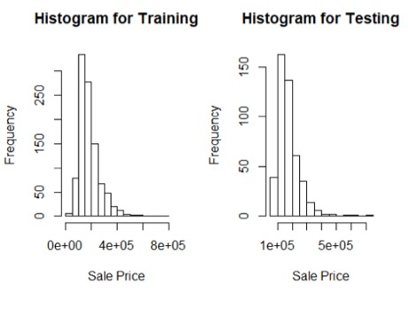

Figure 5 - Histograms of Sale Price for training and testing datasets.

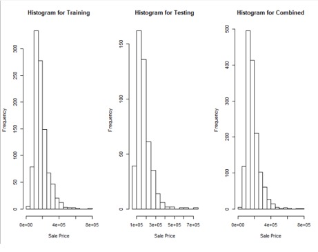

Figure 6 - Histograms for Sale Price for testing, training, and combined
dataset for comparison.

Histogram obtained by the function shown in Figure 5 and Figure 6
visualize the frequency distribution of Sale Price. The similarities are
quite remarkable, with minor variation. Compared, the three data assets
all display a right skewed distribution and are a relatively uniform
across data sets. Conclusively, the number of sales of lower priced
homes is greater overall than that of higher priced homes. This behavior
and skew can be explained by the fact that most people cannot afford to
buy expensive houses.

**Linear Regression Model**
****

A linear regression was performed explaining the response variable Sale Price by all the other
variables. Using linear regression and summary statistics, variables
which are statistically significant predictors can be identified by
their P-values.

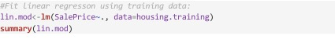

Figure 7 - Multiple linear regression in R, Sale Price explained by all
variables.

The summary statistics
of the linear model also determine that R is significant. The P value
annotated by asterisks in the summary output, shown in Figure 8,
immediately reveal which variables have significant predictive
capability. There are eleven
variables with P values under the significance code level 0.001,
annotated by \*\*\* :
LotArea,
OverallQual,
OverallCond,
YearBuilt,
MasVnrArea,
TotalBsmtSF,
GrLivArea,
BedroomAbvGrd,
KitchenAbvGrd,
TotalRmsAbvGrd, and
GarageArea. All factors exhibit positive influence on Sale Price, (i.e.) as
they increase, so does Sale Price.

The P value represents the
probability of the correlation coefficient being attributed to
variation. P values closer to zero are more significant predictors. The
correlation coefficients are the measure of influence that each variable
has in the prediction (slope of the regression line). A significance
level of 0.001 interpreted as a 0.1% chance that the coefficient will be
equal 0, (i.e.) we are 99% certain that it is significant.

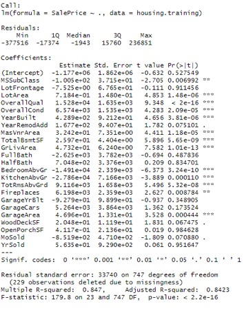

Figure 8 - Summary of linear regression model for Sale Price as
explained by all variables.

Correlation Plots

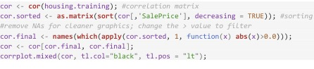

Figure 9 - R code used to generate correlation plots.

Using the R code in
Figure 8, correlation plots are created to visualize the relationships
between variables. Filtering was done by increasing the threshold of
correlations that were plotted to select those with a correlation \> 0.5
or 50% in Figure 11. This yielded 10 variables with the greatest
correlation: OverallQual,
GrLivArea,
GarageCars,
GarageArea,
TotalBsmtSF,
TotRmsAbvGrd,
FullBath,
YearBuilt,
YearRemodAdd. Overall Quality is the
strongest in both evaluations of P-Value and Correlation. The P value of
Overall Quality \< 2e^-16 is impressive.

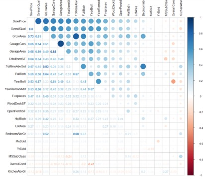  
Figure 10 - Correlation Plot for all variables minus NAs.

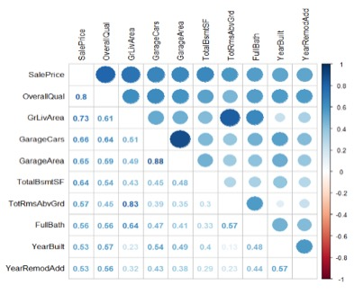

Figure 11 - Correlation plot for variables with correlations \> 0.5.

**Prediction**
****

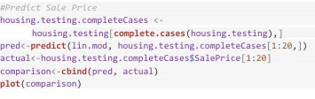

Figure 12 - Predicting Sale Price from the first 20 complete cases of
the testing dataset.

The predict function
was used to calculate the response variable on a small testing sample.
The scatter plot of predicted versus actual, shown in Figure 13,
displays an obvious linear relationship with a positive and increasing
slope. The linear relationship offers a strong visual representation of
the model’s high precision, providing support of the use in
prediction. A table of values
plotted are provided in Figure 14. Comparing the result of difference between predicted and observed
shows a narrow margin of error in most cases.

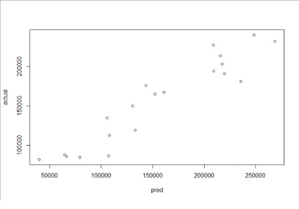

Figure 13 - Comparison scatter plot for predicted vs actual values.

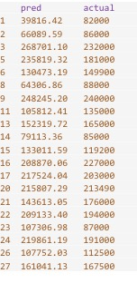  

Figure 14 - View of the comparison data frame containing predicted and
actual values.

**References**
****

Berrier, J.,
Nestler, S., Pardoe, I., Sturdivant, R., &
Watts, K. (2018). ZyBook: Mis 470: Data
Science Foundations.  
DSS - Interpreting Regression Output. (2007). Retrieved October 23,
2019, from <https://dss.princeton.edu/online_help/analysis/interpreting_regression.htm>.

Information Builders. (2018). Ebook.
Explanation of the Regression Model WebFOCUS
8 Technical Library. Retrieved November 6, 2019, from
<https://infocenter.informationbuilders.com/wf80/index.jsp?topic=%2Fpubdocs%2FRStat16%2Fsource%2Ftopic41.htm>

Karimi, M. (2017, August 2). RPubs -
Regression Models - MPG vs AM analysis for
mtcars dataset. .
Retrieved November 6, 2019, from <https://rpubs.com/mkarimi926/296145>

W. N. Venables, D. M. Smith and the R Core Team. (2019). An Introduction
to R \[Epub\] (R, version 3.6.1). Retrieved
November 6, 2019, from
<https://cran.r-project.org/doc/manuals/r-release/R-intro.pdf>

**Appendix I - Variable Descriptions**
****

MSSubClass: Identifies the type of dwelling
involved in the sale.

20 1-STORY 1946 & NEWER ALL
STYLES

30 1-STORY 1945 & OLDER

40 1-STORY W/FINISHED ATTIC
ALL AGES

45 1-1/2 STORY - UNFINISHED
ALL AGES

50 1-1/2 STORY FINISHED ALL
AGES

60 2-STORY 1946 & NEWER

70 2-STORY 1945 & OLDER

75 2-1/2 STORY ALL AGES

80 SPLIT OR MULTI-LEVEL

85 SPLIT FOYER

90 DUPLEX - ALL STYLES AND AGES

120 1-STORY PUD (Planned
Unit Development) - 1946 & NEWER

150 1-1/2 STORY PUD - ALL
AGES

160 2-STORY PUD - 1946 &
NEWER

180 PUD - MULTILEVEL - INCL
SPLIT LEV/FOYER

190 2 FAMILY CONVERSION -
ALL STYLES AND AGES

LotFrontage: Linear feet of street connected
to property

LotArea: Lot size in square feet

OverallQual: Rates the overall material and
finish of the house

10 Very Excellent

9 Excellent

8 Very Good

7 Good

6 Above Average

5 Average

4 Below Average

3 Fair

2 Poor

1 Very Poor

OverallCond: Rates the overall condition of the house

10 Very Excellent

9 Excellent

8 Very Good

7 Good

6 Above Average 

5 Average

4 Below Average 

3 Fair

2 Poor

1 Very Poor

YearBuilt: Original construction date

YearRemodAdd: Remodel date (same as
construction date if no remodeling or additions)

MasVnrArea: Masonry veneer area in square feet

TotalBsmtSF: Total square feet of basement area

GrLivArea: Above grade (ground) living area
square feet

FullBath: Full bathrooms above grade

HalfBath: Half baths above grade

BedroomAbvGr: Bedrooms above grade (does NOT
include basement bedrooms)

KitchenAbvGr: Kitchens above grade

TotRmsAbvGrd: Total rooms above grade (does
not include bathrooms)

Fireplaces: Number of fireplaces

GarageYrBlt: Year garage was built

GarageCars: Size of garage in car capacity

GarageArea: Size of garage in square feet

WoodDeckSF: Wood deck area in square feet

OpenPorchSF: Open porch area in square feet

MoSold: Month Sold (MM)

YrSold: Year Sold (YYYY)

Special Thanks to Kaggle Member Erik Bruin for his providing these in
his report on the original data set.
<https://www.kaggle.com/erikbruin/house-prices-lasso-xgboost-and-a-detailed-eda/report>